# Case Study 2: Chulwalar Exports Forecasting Model
Oscar Padilla  
July 27, 2016  

# Set Up

```r
library(fpp) # for time series forecasting and analysis
```

```
## Loading required package: forecast
```

```
## Loading required package: zoo
```

```
## 
## Attaching package: 'zoo'
```

```
## The following objects are masked from 'package:base':
## 
##     as.Date, as.Date.numeric
```

```
## Loading required package: timeDate
```

```
## This is forecast 7.1
```

```
## Loading required package: fma
```

```
## Loading required package: tseries
```

```
## Loading required package: expsmooth
```

```
## Loading required package: lmtest
```

```r
library(forecast) # for some other forecasting models
library(Metrics)
library(ggplot2)
setwd("/Users/GS7271/Documents/MSDS6306/Unit10/ChulwalarCase")
```

# Import the data

```r
# Import raw .csv files
ImportedAsIsData <- read.csv(file="ImportedAsIsDataChulwalar.csv", header = F, sep=";", fill = T) 
ImportedPlanData <- read.csv(file="ImportedPlanDataChulwalar.csv", header = F, sep=";", fill = T) 
ImportedIndicators <- read.csv(file="ImportedIndicatorsChulwalar.csv", header = F, sep=";", fill = T)
```

# Transform data into time series
In order to be able to work with the partial data sets later, these need to be split into individual vectors and converted into times series.

```r
## I would not have this code in the final draft of the case study. These code need to be in an appendix, even if they are put into a makefile.
TotalAsIsVector <- c(ImportedAsIsData [2:13,2],ImportedAsIsData [2:13,3],ImportedAsIsData [2:13,4],ImportedAsIsData [2:13,5],ImportedAsIsData [2:13,6],ImportedAsIsData [2:13,7])
YearAsIsVector <- c(ImportedAsIsData [86,2],ImportedAsIsData [86,3],ImportedAsIsData [86,4],ImportedAsIsData [86,5],ImportedAsIsData [86,6],ImportedAsIsData [86,7])
TotalAsIsVector_2014 <- c(ImportedAsIsData[2:13,8])

PlanVector <- c(ImportedPlanData[2:13,2],ImportedPlanData[2:13,3],ImportedPlanData[2:13,4],ImportedPlanData[2:13,5],ImportedPlanData[2:13,6],ImportedPlanData[2:13,7])
YearPlanVector <- c(ImportedPlanData[86,2],ImportedPlanData[86,3],ImportedPlanData[86,4],ImportedPlanData[86,5],ImportedPlanData[86,6],ImportedPlanData[86,7])
PlanVector_2014 <- c(ImportedPlanData[2:13,8])

# The data is saved as a vector and needs to be converted into a time series
TotalAsIs<- ts(TotalAsIsVector , start=c(2008,1), end=c(2013,12), frequency=12)
YearAsIs <- ts(YearAsIsVector, start=c(2008,1), end=c(2013,12), frequency=12)
TotalAsIs_2014 <- ts(TotalAsIsVector_2014, start=c(2014,1), end=c(2014,12), frequency=12)

TotalPlan <- ts(PlanVector , start=c(2008,1), end=c(2013,12), frequency=12)
YearPlan <- ts(YearPlanVector, start=c(2008,1), end=c(2013,12), frequency=12)
TotalPlan_2014 <- ts(PlanVector_2014, start=c(2014,1), end=c(2014,12), frequency=12)
```

# Basic data analysis

## Use STL function for decomposition
The time series can be analysed using the stl function in order to seperate the trend, seasonality and remainder (remaining coincidential) components from one another.

```r
TotalAsIs_stl <- stl(TotalAsIs, s.window=5)
plot(TotalAsIs_stl, col="black", main="TotalAsIs_stl")
```

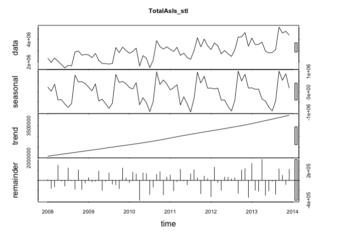<!-- -->

```r
plot(TotalAsIs)
lines(TotalAsIs_stl$time.series[,"trend"], col = "red")
```

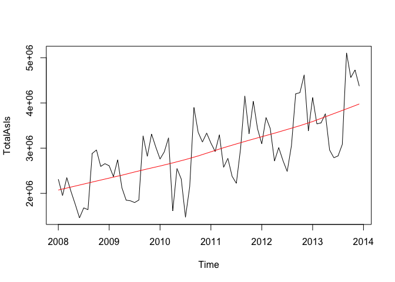<!-- -->

## Modify seasonal component to a monthly base
The modification of the seasonlity component can also be changed into a monthly view. It only makes sense to do this if the seasonality component as the trend looks almost identical and the remainder is then randomly spread.


```r
monthplot(TotalAsIs_stl$time.series[,"seasonal"], main="", ylab="Seasonal")
```

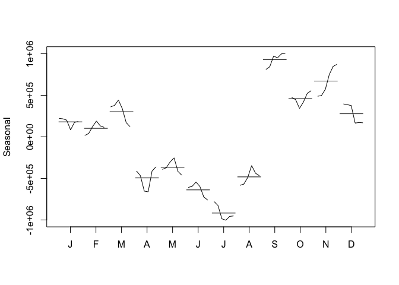<!-- -->

# Correlation with external indicators

## Monthly Change in Export Price Index (CEPI)

```r
CEPIVector <- c(ImportedIndicators[2:13,2],ImportedIndicators[2:13,3],ImportedIndicators[2:13,4],ImportedIndicators[2:13,5],ImportedIndicators[2:13,6],ImportedIndicators[2:13,7])
CEPI <- ts(CEPIVector , start=c(2008,1), end=c(2013,12), frequency=12)
plot(CEPI, main="CEPI")
```

<!-- -->

```r
plot(TotalAsIs_stl$time.series[,"trend"]/20000, type = "o", col = "red", ylab = "Trend")
```

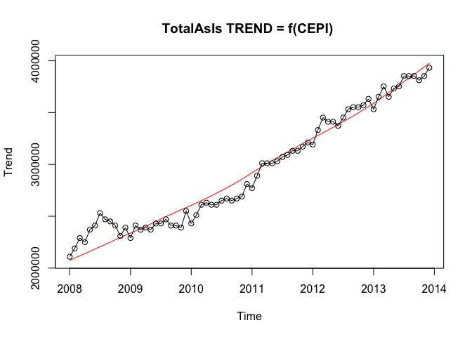<!-- -->

```r
cor(TotalAsIs, CEPI)
```

```
## [1] 0.663925
```

```r
cor(TotalAsIs_stl$time.series[,"trend"], CEPI)
```

```
## [1] 0.9826684
```

## Average monthly temperatures in Chulwalar

```r
TemperatureVector <- c(ImportedIndicators[30:41,2],ImportedIndicators[30:41,3],ImportedIndicators[30:41,4],ImportedIndicators[30:41,5],ImportedIndicators[30:41,6],ImportedIndicators[30:41,7])
Temperature <- ts(TemperatureVector, start=c(2008,1), end=c(2013,12), frequency=12)
plot(Temperature, main="Temperature")
lines(5 + TotalAsIs_stl$time.series[,"seasonal"]/100000, type ="o", col = "red", ylab = "Seasonality")
```

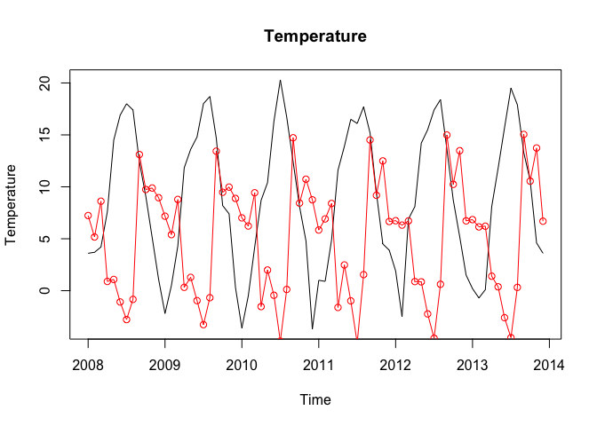<!-- -->

```r
cor(TotalAsIs, Temperature)
```

```
## [1] -0.3429684
```

```r
cor(TotalAsIs_stl$time.series[,"seasonal"], 1/Temperature)
```

```
## [1] 0.07905394
```

## Monthly Average Export Price Index for Chulwalar

```r
AEPIVector <- c(ImportedIndicators[100:111,2],ImportedIndicators[100:111,3],ImportedIndicators[100:111,4],ImportedIndicators[100:111,5],ImportedIndicators[100:111,6],ImportedIndicators[100:111,7])
AEPI <- ts(AEPIVector, start=c(2008,1), end=c(2013,12), frequency=12)
plot(AEPI, main="AEPI")
```

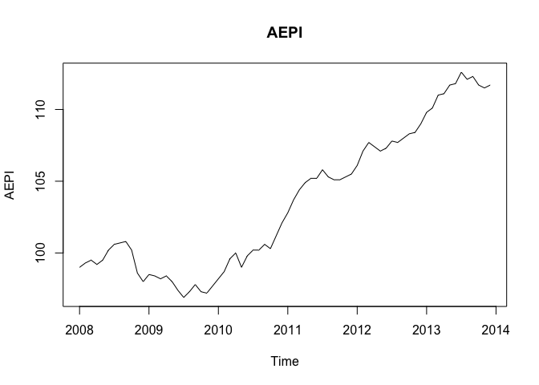<!-- -->

```r
cor(TotalAsIs, AEPI)
```

```
## [1] 0.625232
```

## National Holidays

```r
NationalHolidaysVector <- c(ImportedIndicators[170:181,2],ImportedIndicators[170:181,3],ImportedIndicators[170:181,4],ImportedIndicators[170:181,5],ImportedIndicators[170:181,6],ImportedIndicators[170:181,7])
NationalHolidays <- ts(NationalHolidaysVector, start=c(2008,1), end=c(2013,12), frequency=12)
plot(NationalHolidays, main="NationalHolidays")
```

<!-- -->

```r
cor(TotalAsIs, NationalHolidays)
```

```
## [1] -0.007883708
```

# Monthly Inflation rate in Chulwalar 

```r
InflationVector <- c(ImportedIndicators[142:153,2],ImportedIndicators[142:153,3],ImportedIndicators[142:153,4],ImportedIndicators[142:153,5],ImportedIndicators[142:153,6],ImportedIndicators[142:153,7])
Inflation <- ts(InflationVector, start=c(2008,1), end=c(2013,12), frequency=12)
plot(Inflation, main="Inflation")
```

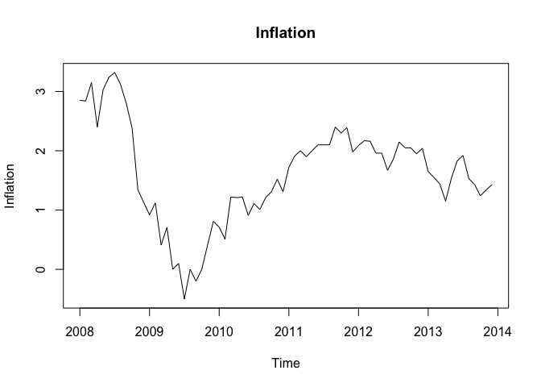<!-- -->

```r
cor(TotalAsIs, Inflation)
```

```
## [1] 0.002438708
```

# Proposed spending for Independence day presents

```r
IndependenceDayPresentsVector <- c(ImportedIndicators[156:167,2],ImportedIndicators[156:167,3],ImportedIndicators[156:167,4],ImportedIndicators[156:167,5],ImportedIndicators[156:167,6],ImportedIndicators[156:167,7])
IndependenceDayPresents <- ts(IndependenceDayPresentsVector, start=c(2008,1), end=c(2013,12), frequency=12)
plot(IndependenceDayPresents, main="IndependenceDayPresents")
```

<!-- -->

```r
cor(TotalAsIs, IndependenceDayPresents)
```

```
## [1] 0.4359522
```


# Forecasting models with smoothing and related approaches
Exponential Smoothing uses past values to calculate a forecast. The strength with which each value influences the forecast is weakened with help of a smoothing parameter. Thus we are dealing with a weighted average, whose values fade out the longer ago they were in the past.

The Akaike's Information Criterion(AIC/AICc) or the Bayesian Information Criterion (BIC) should be at minimum.

## Simple expontential smoothing    

```r
Model_ses <- ses(TotalAsIs, h=12)
summary(Model_ses)
```

```
## 
## Forecast method: Simple exponential smoothing
## 
## Model Information:
## Simple exponential smoothing 
## 
## Call:
##  ses(x = TotalAsIs, h = 12) 
## 
##   Smoothing parameters:
##     alpha = 0.671 
## 
##   Initial states:
##     l = 2173226.7433 
## 
##   sigma:  609507
## 
##      AIC     AICc      BIC 
## 2230.058 2230.232 2234.612 
## 
## Error measures:
##                    ME   RMSE      MAE       MPE     MAPE     MASE
## Training set 47469.84 609507 429997.1 -1.511008 15.02336 1.172074
##                    ACF1
## Training set 0.02384493
## 
## Forecasts:
##          Point Forecast   Lo 80   Hi 80   Lo 95   Hi 95
## Jan 2014        4466448 3685333 5247562 3271836 5661059
## Feb 2014        4466448 3525801 5407094 3027853 5905042
## Mar 2014        4466448 3389650 5543245 2819628 6113267
## Apr 2014        4466448 3268880 5664015 2634926 6297969
## May 2014        4466448 3159220 5773675 2467215 6465680
## Jun 2014        4466448 3058072 5874823 2312524 6620371
## Jul 2014        4466448 2963718 5969177 2168221 6764674
## Aug 2014        4466448 2874947 6057948 2032458 6900437
## Sep 2014        4466448 2790873 6142022 1903878 7029017
## Oct 2014        4466448 2710821 6222074 1781448 7151447
## Nov 2014        4466448 2634263 6298632 1664363 7268532
## Dec 2014        4466448 2560778 6372117 1551977 7380918
```

```r
plot(Model_ses, plot.conf=FALSE, ylab="Exports Chulwalar", xlab="Year", main="Simple Exponential Smoothing", fcol="white")
lines(fitted(Model_ses), col="green", type="o")
lines(Model_ses$mean, col="blue", type="o")
lines(TotalAsIs_2014, col="red")
legend("topleft", lty = 1, col = c(1,"green"), c("data", expression(alpha == 0.671)), pch=1)
```

<!-- -->

```r
# Now we will compare our model against actual 2014 figures
Model_ses_df <- as.data.frame(Model_ses) 
SES <- ts(Model_ses_df$"Point Forecast", start=c(2014,1), end=c(2014,12), frequency=12)
compareModels <- ts.union(TotalAsIs_2014, SES)
RMSE_SES <- rmse(TotalAsIs_2014, SES)
RMSE_SES
```

```
## [1] 739820.2
```

## Holt's linear trend method   
Holt added to the model in order to forecast using trends as well. For this it is necessary to add a beta, which determines the trend. If neither alpha nor beta is stated, both parameters will be optimized using ets(). The trend is exponential if the intercepts(level) and the gradient (slope) are multiplied with each other. The values are worse. As the Beta was very low in the optimization, the forecast is very similar to the ses() model. 

```r
Model_holt_1 <- holt(TotalAsIs,h=12)
summary(Model_holt_1)
```

```
## 
## Forecast method: Holt's method
## 
## Model Information:
## Holt's method 
## 
## Call:
##  holt(x = TotalAsIs, h = 12) 
## 
##   Smoothing parameters:
##     alpha = 0.6571 
##     beta  = 1e-04 
## 
##   Initial states:
##     l = 2040390.7764 
##     b = 45050.7514 
## 
##   sigma:  608119.1
## 
##      AIC     AICc      BIC 
## 2233.730 2234.327 2242.837 
## 
## Error measures:
##                    ME     RMSE      MAE      MPE     MAPE     MASE
## Training set -16586.9 608119.1 441110.7 -3.88925 15.75307 1.202367
##                    ACF1
## Training set 0.03462672
## 
## Forecasts:
##          Point Forecast   Lo 80   Hi 80   Lo 95   Hi 95
## Jan 2014        4536367 3757031 5315703 3344475 5728259
## Feb 2014        4581298 3648703 5513894 3155016 6007580
## Mar 2014        4626230 3562188 5690271 2998918 6253541
## Apr 2014        4671161 3490181 5852141 2865008 6477314
## May 2014        4716092 3428721 6003463 2747228 6684956
## Jun 2014        4761024 3375378 6146669 2641862 6880185
## Jul 2014        4805955 3328531 6283379 2546429 7065480
## Aug 2014        4850886 3287035 6414738 2459182 7242591
## Sep 2014        4895818 3250047 6541588 2378829 7412807
## Oct 2014        4940749 3216925 6664573 2304387 7577111
## Nov 2014        4985680 3187164 6784196 2235088 7736273
## Dec 2014        5030612 3160363 6900860 2170314 7890909
```

```r
plot(Model_holt_1)
lines(TotalAsIs_2014, col="red")
```

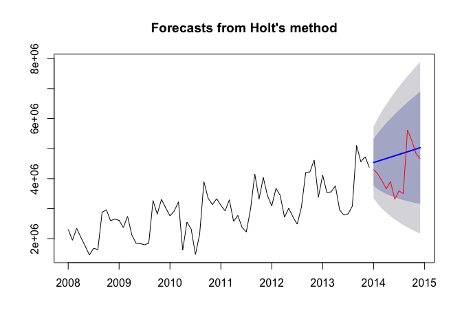<!-- -->

```r
# Now we will compare our model against actual 2014 figures
Model_holt1_df <- as.data.frame(Model_holt_1) 
Holt_Linear <- ts(Model_holt1_df$"Point Forecast", start=c(2014,1), end=c(2014,12), frequency=12)
compareModels <- ts.union(compareModels, Holt_Linear)
RMSE_LINEAR <- rmse(TotalAsIs_2014, Holt_Linear)
RMSE_LINEAR
```

```
## [1] 845869.2
```

```r
# expoential trend
Model_holt_2 <- holt(TotalAsIs, exponential=TRUE,h=12)
summary(Model_holt_2)
```

```
## 
## Forecast method: Holt's method with exponential trend
## 
## Model Information:
## Holt's method with exponential trend 
## 
## Call:
##  holt(x = TotalAsIs, h = 12, exponential = TRUE) 
## 
##   Smoothing parameters:
##     alpha = 0.6637 
##     beta  = 1e-04 
## 
##   Initial states:
##     l = 2041538.9468 
##     b = 1.0029 
## 
##   sigma:  0.2438
## 
##      AIC     AICc      BIC 
## 2251.010 2251.607 2260.116 
## 
## Error measures:
##                    ME     RMSE      MAE       MPE     MAPE     MASE
## Training set 37825.61 609787.5 433018.9 -1.838214 15.18487 1.180311
##                    ACF1
## Training set 0.02918287
## 
## Forecasts:
##          Point Forecast   Lo 80   Hi 80   Lo 95    Hi 95
## Jan 2014        4488281 3113381 5872132 2306946  6613899
## Feb 2014        4502175 2909019 6260171 2228392  7439552
## Mar 2014        4516113 2723560 6579120 2004915  8019238
## Apr 2014        4530094 2523254 6844671 1801374  8507279
## May 2014        4544118 2402922 7105834 1667776  8907345
## Jun 2014        4558186 2274597 7232566 1621620  9516695
## Jul 2014        4572297 2179287 7460782 1461084  9789634
## Aug 2014        4586452 2053376 7643838 1389970 10276841
## Sep 2014        4600650 1996907 7877387 1305481 10769754
## Oct 2014        4614893 1883443 7872917 1214746 10951511
## Nov 2014        4629180 1838931 7938408 1144201 11306793
## Dec 2014        4643510 1688277 8190635 1067416 11740980
```

```r
plot(Model_holt_2)
lines(TotalAsIs_2014, col="red")
```

<!-- -->

```r
# Now we will compare our model against actual 2014 figures
Model_holt2_df <- as.data.frame(Model_holt_2) 
Holt_Exponential <- ts(Model_holt2_df$"Point Forecast", start=c(2014,1), end=c(2014,12), frequency=12)
compareModels <- ts.union(compareModels, Holt_Exponential)
RMSE_EXPO <- rmse(TotalAsIs_2014, Holt_Exponential)
RMSE_EXPO
```

```
## [1] 756849.7
```

## Dampened trends
As such simple trends tend to forecast the future to positively, we have added a dampener. This also works for exponential trends. We also plot the level and slope individually for each model.

```r
Model_holt_3 <- holt(TotalAsIs, damped=TRUE,h=12)
summary(Model_holt_3)
```

```
## 
## Forecast method: Damped Holt's method
## 
## Model Information:
## Damped Holt's method 
## 
## Call:
##  holt(x = TotalAsIs, h = 12, damped = TRUE) 
## 
##   Smoothing parameters:
##     alpha = 0.6613 
##     beta  = 2e-04 
##     phi   = 0.98 
## 
##   Initial states:
##     l = 2040392.5761 
##     b = 45053.25 
## 
##   sigma:  608787.2
## 
##      AIC     AICc      BIC 
## 2235.888 2236.797 2247.272 
## 
## Error measures:
##                    ME     RMSE      MAE       MPE     MAPE     MASE
## Training set 15578.94 608787.2 436909.7 -2.797612 15.46526 1.190916
##                    ACF1
## Training set 0.03351419
## 
## Forecasts:
##          Point Forecast   Lo 80   Hi 80   Lo 95   Hi 95
## Jan 2014        4483618 3703426 5263811 3290417 5676819
## Feb 2014        4493914 3558436 5429391 3063224 5924603
## Mar 2014        4504003 3435520 5572486 2869899 6138107
## Apr 2014        4513891 3327168 5700614 2698955 6328827
## May 2014        4523581 3229332 5817829 2544198 6502963
## Jun 2014        4533077 3139534 5926619 2401837 6664316
## Jul 2014        4542383 3056128 6028638 2269352 6815413
## Aug 2014        4551503 2977955 6125051 2144969 6958036
## Sep 2014        4560440 2904162 6216719 2027381 7093499
## Oct 2014        4569199 2834101 6304298 1915595 7222803
## Nov 2014        4577783 2767264 6388301 1808834 7346732
## Dec 2014        4586195 2703249 6469141 1706477 7465913
```

```r
plot(Model_holt_3)
lines(TotalAsIs_2014, col="red")
```

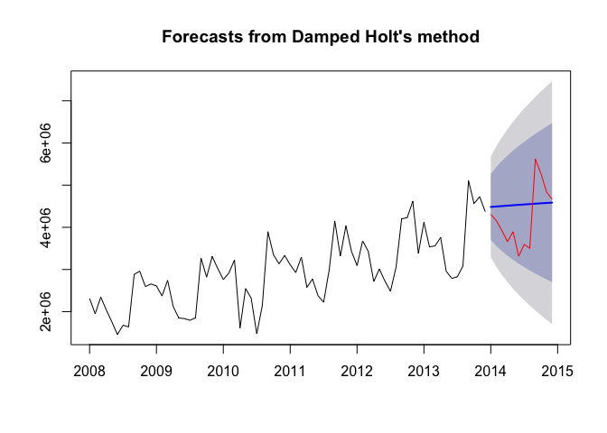<!-- -->

```r
# Now we will compare our model against actual 2014 figures
Model_holt3_df <- as.data.frame(Model_holt_3) 
Damped <- ts(Model_holt3_df$"Point Forecast", start=c(2014,1), end=c(2014,12), frequency=12)
compareModels <- ts.union(compareModels, Damped)
RMSE_DAMPED <- rmse(TotalAsIs_2014, Damped)
RMSE_DAMPED
```

```
## [1] 751687.6
```

```r
Model_holt_4 <- holt(TotalAsIs, exponential=TRUE, damped=TRUE,h=12)
summary(Model_holt_4)
```

```
## 
## Forecast method: Damped Holt's method with exponential trend
## 
## Model Information:
## Damped Holt's method with exponential trend 
## 
## Call:
##  holt(x = TotalAsIs, h = 12, damped = TRUE, exponential = TRUE) 
## 
##   Smoothing parameters:
##     alpha = 0.6679 
##     beta  = 1e-04 
##     phi   = 0.9799 
## 
##   Initial states:
##     l = 2041541.9705 
##     b = 1.0019 
## 
##   sigma:  0.2449
## 
##      AIC     AICc      BIC 
## 2253.216 2254.125 2264.600 
## 
## Error measures:
##                    ME     RMSE      MAE       MPE     MAPE     MASE
## Training set 46119.56 609906.7 432069.1 -1.549114 15.11987 1.177722
##                   ACF1
## Training set 0.0254941
## 
## Forecasts:
##          Point Forecast   Lo 80   Hi 80   Lo 95    Hi 95
## Jan 2014        4470648 3024548 5841207 2331511  6550453
## Feb 2014        4473164 2833483 6226196 2123994  7300871
## Mar 2014        4475630 2609313 6511404 1923056  7896832
## Apr 2014        4478047 2503211 6678466 1763632  8561910
## May 2014        4480418 2298089 6962794 1600539  8966503
## Jun 2014        4482742 2174102 7207340 1538860  9383637
## Jul 2014        4485020 2075899 7372299 1376640  9893891
## Aug 2014        4487253 1946452 7451375 1302358 10072773
## Sep 2014        4489443 1908289 7795931 1257133 11007961
## Oct 2014        4491589 1821442 7851059 1135448 10985534
## Nov 2014        4493694 1724030 7977142 1086429 11707921
## Dec 2014        4495757 1667557 8161885 1061679 11903225
```

```r
plot(Model_holt_4)
lines(TotalAsIs_2014, col="red")
```

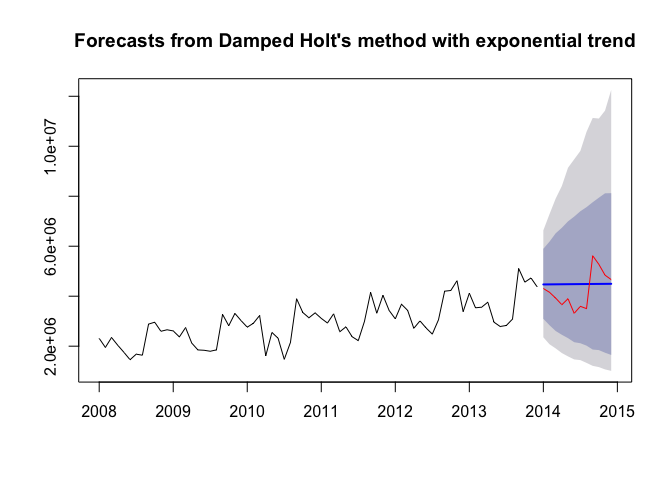<!-- -->

```r
# Now we will compare our model against actual 2014 figures
Model_holt4_df <- as.data.frame(Model_holt_4) 
DampedExpo <- ts(Model_holt4_df$"Point Forecast", start=c(2014,1), end=c(2014,12), frequency=12)
compareModels <- ts.union(compareModels, DampedExpo)
RMSE_DAMPEXPO <- rmse(TotalAsIs_2014, DampedExpo)
RMSE_DAMPEXPO
```

```
## [1] 741994.9
```

```r
# level and slope can be plotted individually for each model. 
plot(Model_holt_1$model$state)
```

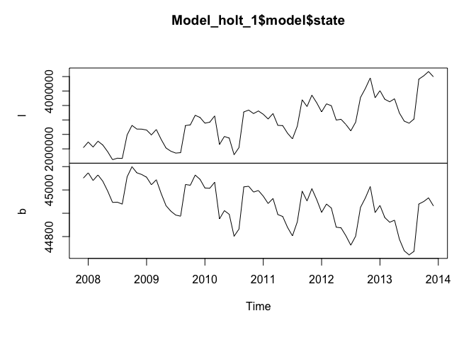<!-- -->

```r
plot(Model_holt_2$model$state)
```

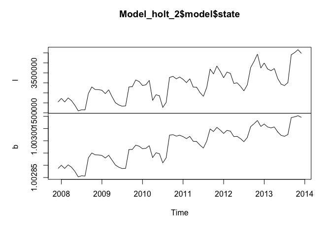<!-- -->

```r
plot(Model_holt_3$model$state)
```

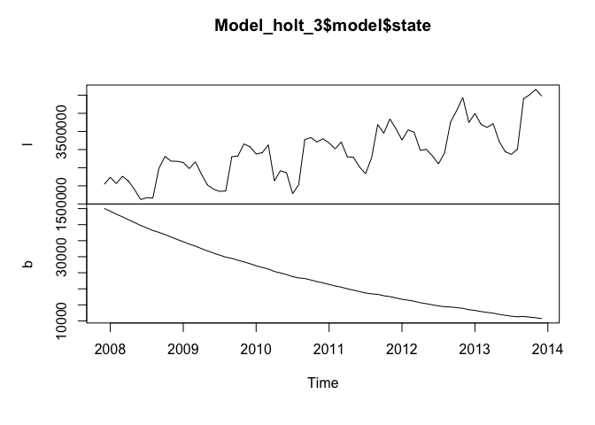<!-- -->

```r
plot(Model_holt_4$model$state)
```

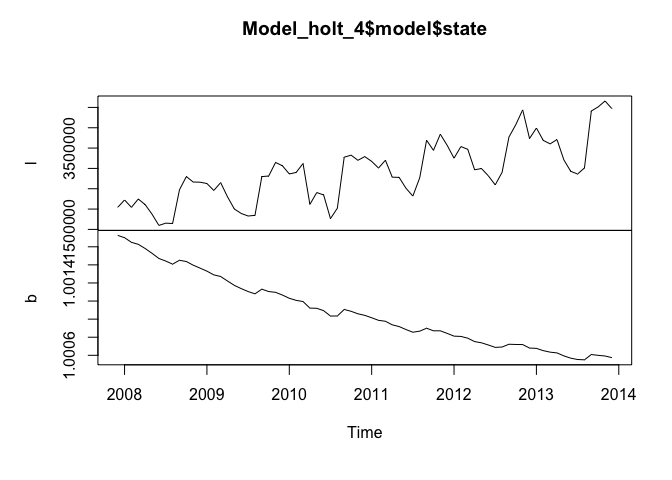<!-- -->

```r
plot(Model_holt_1, plot.conf=FALSE, ylab="Exports Chulwalar", xlab="Year", main="", fcol="white")
lines(fitted(Model_ses), col="purple", type="o")
lines(fitted(Model_holt_1), col="blue", type="o")
lines(fitted(Model_holt_2), col="red", type="o")
lines(fitted(Model_holt_3), col="green", type="o")
lines(fitted(Model_holt_4), col="orange", type="o")
lines(Model_ses$mean, col="purple", type="o")
lines(Model_holt_1$mean, col="blue", type="o")
lines(Model_holt_2$mean, col="red", type="o")
lines(Model_holt_3$mean, col="green", type="o")
lines(Model_holt_4$mean, col="orange", type="o")
legend("topleft",lty=1, col=c(1,"purple","blue","red","green","orange"), c("data", "SES","Holts auto", "Exponential", "Additive Damped", "Multiplicative Damped"),pch=1)
```

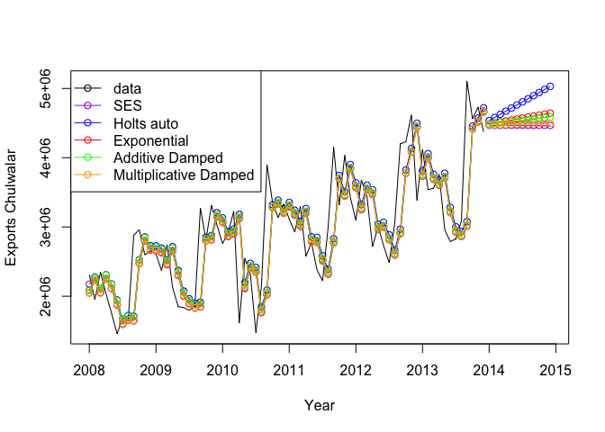<!-- -->

## Holt-Winter's seasonal method   
Holt and Winters have expanded Holt's model further to include the seasonality aspect. The parameter gamma, which is for smoothing the seasonality, was added to achieve this. The values are better than the models without seasonality. This is logical, since the data is strongly influenced by seasonality.  In the following model, none of the parameters are given so that they will be optimised automatically. There are two models: one using an additive error model method and one using a multiplicative error model. The additive model gives slightly better results than the multiplicative model.


```r
Model_hw_1 <- hw(TotalAsIs ,seasonal="additive",h=12)
summary(Model_hw_1)
```

```
## 
## Forecast method: Holt-Winters' additive method
## 
## Model Information:
## Holt-Winters' additive method 
## 
## Call:
##  hw(x = TotalAsIs, h = 12, seasonal = "additive") 
## 
##   Smoothing parameters:
##     alpha = 0.0087 
##     beta  = 0.0087 
##     gamma = 1e-04 
## 
##   Initial states:
##     l = 2047375.0884 
##     b = 22509.7631 
##     s=259168.3 654942.6 474529.8 876025.2 -475155 -852844
##            -664662.5 -412596.7 -438677.3 273215 138077.9 167976.7
## 
##   sigma:  241685
## 
##      AIC     AICc      BIC 
## 2124.856 2134.747 2161.283 
## 
## Error measures:
##                    ME   RMSE      MAE         MPE     MAPE      MASE
## Training set 21615.43 241685 202218.5 -0.08252109 7.329458 0.5512016
##                    ACF1
## Training set -0.2819072
## 
## Forecasts:
##          Point Forecast   Lo 80   Hi 80   Lo 95   Hi 95
## Jan 2014        4141204 3831472 4450936 3667510 4614898
## Feb 2014        4147309 3837472 4457147 3673453 4621165
## Mar 2014        4318537 4008512 4628563 3844394 4792680
## Apr 2014        3642744 3332425 3953063 3168153 4117335
## May 2014        3704865 3394124 4015605 3229628 4180102
## Jun 2014        3488859 3177546 3800173 3012746 3964973
## Jul 2014        3336738 3024677 3648799 2859482 3813994
## Aug 2014        3750478 3437474 4063482 3271780 4229176
## Sep 2014        5137771 4823607 5451935 4657298 5618244
## Oct 2014        4772337 4456775 5087900 4289726 5254949
## Nov 2014        4988809 4671591 5306028 4503665 5473953
## Dec 2014        4629097 4309943 4948252 4140992 5117202
```

```r
plot(Model_hw_1)
lines(TotalAsIs_2014, col="red")
```

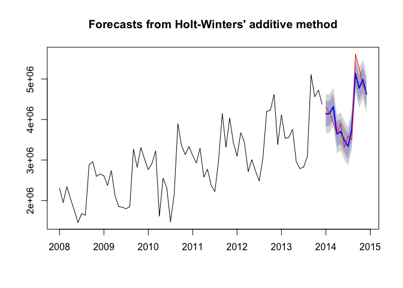<!-- -->

```r
# Now we will compare our model against actual 2014 figures
Model_hw_1_df <- as.data.frame(Model_hw_1) 
HW_Add <- ts(Model_hw_1_df$"Point Forecast", start=c(2014,1), end=c(2014,12), frequency=12)
compareModels <- ts.union(compareModels, HW_Add)
RMSE_HW_ADD <- rmse(TotalAsIs_2014, HW_Add)
RMSE_HW_ADD
```

```
## [1] 271816.7
```

```r
Model_hw_2 <- hw(TotalAsIs ,seasonal="multiplicative",h=12)
summary(Model_hw_2)
```

```
## 
## Forecast method: Holt-Winters' multiplicative method
## 
## Model Information:
## Holt-Winters' multiplicative method 
## 
## Call:
##  hw(x = TotalAsIs, h = 12, seasonal = "multiplicative") 
## 
##   Smoothing parameters:
##     alpha = 0.025 
##     beta  = 0.0062 
##     gamma = 1e-04 
## 
##   Initial states:
##     l = 2026247.531 
##     b = 25395.1259 
##     s=1.0933 1.232 1.1763 1.3086 0.8384 0.699
##            0.7653 0.8502 0.8596 1.0793 1.0316 1.0665
## 
##   sigma:  0.0877
## 
##      AIC     AICc      BIC 
## 2128.303 2138.194 2164.729 
## 
## Error measures:
##                    ME     RMSE      MAE        MPE     MAPE      MASE
## Training set 17434.11 235296.6 191805.3 -0.3292809 7.213472 0.5228175
##                    ACF1
## Training set -0.3514421
## 
## Forecasts:
##          Point Forecast   Lo 80   Hi 80   Lo 95   Hi 95
## Jan 2014        4226941 3751624 4702258 3500006 4953876
## Feb 2014        4123665 3659738 4587591 3414151 4833179
## Mar 2014        4350808 3860995 4840620 3601704 5099911
## Apr 2014        3494208 3100476 3887940 2892046 4096370
## May 2014        3484738 3091618 3877858 2883513 4085963
## Jun 2014        3162774 2805463 3520085 2616314 3709234
## Jul 2014        2912399 2582802 3241996 2408324 3416474
## Aug 2014        3521645 3122278 3921013 2910865 4132425
## Sep 2014        5540988 4911109 6170867 4577671 6504304
## Oct 2014        5020487 4448200 5592775 4145249 5895725
## Nov 2014        5299729 4693715 5905743 4372911 6226547
## Dec 2014        4740169 4196230 5284108 3908286 5572052
```

```r
plot(Model_hw_2)
lines(TotalAsIs_2014, col="red")
```

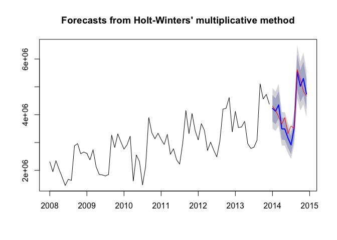<!-- -->

```r
# Now we will compare our model against actual 2014 figures
Model_hw_2_df <- as.data.frame(Model_hw_2) 
HW_Mul <- ts(Model_hw_2_df$"Point Forecast", start=c(2014,1), end=c(2014,12), frequency=12)
compareModels <- ts.union(compareModels, HW_Mul)
RMSE_HW_MUL <- rmse(TotalAsIs_2014, HW_Mul)
RMSE_HW_MUL
```

```
## [1] 311363.4
```

# Use accuracy measurements to determine which method is best
##Performance comparison of the forecasting models

```r
colnames(compareModels) <- c("TotalAsIs2014", "SES", "Holt_Linear", "Holt_Exponential", "Damped", "DampedExpo", "HW_Add", "HW_Mul")
compareModels
```

```
##          TotalAsIs2014     SES Holt_Linear Holt_Exponential  Damped
## Jan 2014       4308161 4466448     4536367          4488281 4483618
## Feb 2014       4155378 4466448     4581298          4502175 4493914
## Mar 2014       3924332 4466448     4626230          4516113 4504003
## Apr 2014       3659121 4466448     4671161          4530094 4513891
## May 2014       3898758 4466448     4716092          4544118 4523581
## Jun 2014       3313891 4466448     4761024          4558186 4533077
## Jul 2014       3595106 4466448     4805955          4572297 4542383
## Aug 2014       3502426 4466448     4850886          4586452 4551503
## Sep 2014       5619059 4466448     4895818          4600650 4560440
## Oct 2014       5274287 4466448     4940749          4614893 4569199
## Nov 2014       4841693 4466448     4985680          4629180 4577783
## Dec 2014       4664854 4466448     5030612          4643510 4586195
##          DampedExpo  HW_Add  HW_Mul
## Jan 2014    4470648 4141204 4226941
## Feb 2014    4473164 4147309 4123665
## Mar 2014    4475630 4318537 4350808
## Apr 2014    4478047 3642744 3494208
## May 2014    4480418 3704865 3484738
## Jun 2014    4482742 3488859 3162774
## Jul 2014    4485020 3336738 2912399
## Aug 2014    4487253 3750478 3521645
## Sep 2014    4489443 5137771 5540988
## Oct 2014    4491589 4772337 5020487
## Nov 2014    4493694 4988809 5299729
## Dec 2014    4495757 4629097 4740169
```

```r
plot(Model_hw_1, ylab = "Exports Chulwalar", plot.conf=FALSE, fcol="white", xlab="Year")
lines(fitted(Model_hw_1), col="blue", lty=2)
lines(fitted(Model_hw_2), col="green", lty=2)
lines(Model_hw_1$mean, type="o", col="blue")
lines(Model_hw_2$mean, type="o", col="green")
lines(TotalAsIs_2014, col = "red")
legend("topleft",lty=1, pch=1, col=1:3, c("data","Holt Winters' Additive","Holt Winters' Multiplicative"))
```

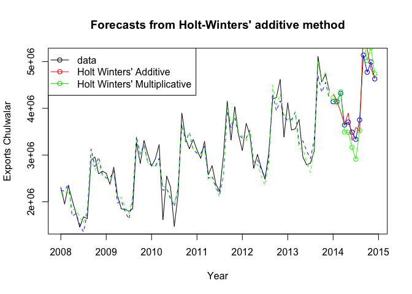<!-- -->

```r
# Output instruction for the data export of the results for further use in Excel.
write.csv(compareModels, file='ChulwalarForecastModelsComparison.csv')
```

# Summarize results

```r
rmse_labels <- c("SES", "Holt_Linear", "Holt_Exponential", "Damped", "DampedExpo", "HW_Add", "HW_Mul")
rmse_values <- c(RMSE_SES, RMSE_LINEAR, RMSE_EXPO, RMSE_DAMPED, RMSE_DAMPEXPO, RMSE_HW_ADD, RMSE_HW_MUL)
RMSE_table <- data.frame(rmse_labels, rmse_values)
RMSE_table
```

```
##        rmse_labels rmse_values
## 1              SES    739820.2
## 2      Holt_Linear    845869.2
## 3 Holt_Exponential    756849.7
## 4           Damped    751687.6
## 5       DampedExpo    741994.9
## 6           HW_Add    271816.7
## 7           HW_Mul    311363.4
```

```r
g <- ggplot(RMSE_table, aes(rmse_labels, rmse_values))
g + geom_bar(stat = "identity") + scale_fill_grey()
```

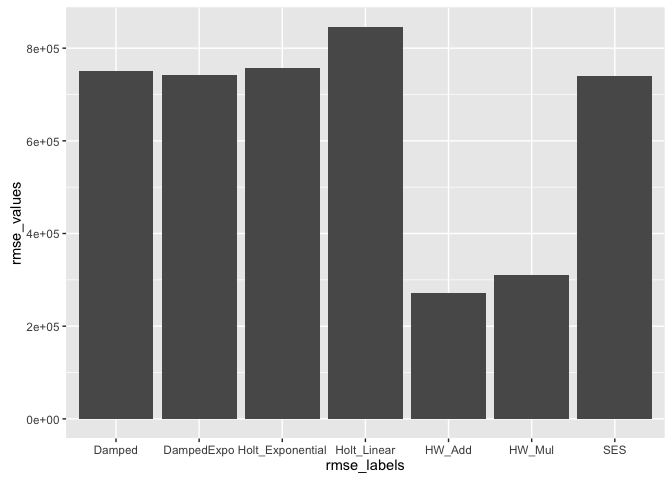<!-- -->

Holt-Winter's Multiplicative model has the lowest RMSE (235296.6) when measured against historical (test) data.
However it's only the second best peformance against 2014 actual data 311363.4
Holt-Winter's Additive model is the best performer predicting 2014 data (RMSE = 271816.7)
